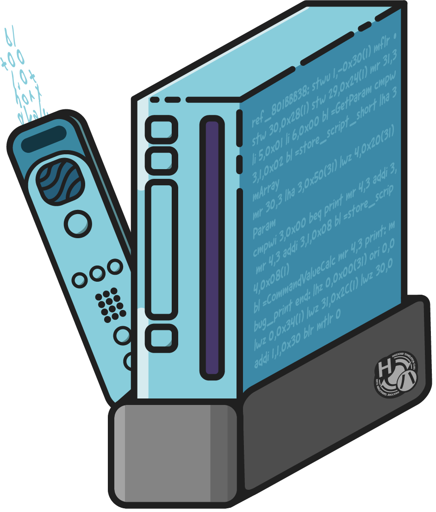

<h1 align="center">
  
  <br/>
  Wiinject
  <br/>
</h1>

Wiinject is a cross-platform tool for injecting ASM hacks into Wii games using Riivolution memory patches. Pass it a folder containing `.s` PowerPC assembly files and/or `.c` C files and a series of injection sites and it will assemble the files and give you a memory file and a
series of Riivolution XML memory patches.

## Usage

### Prerequisites
Wiinject requires the following to run:
* [ninja](https://ninja-build.org)
* [devkitPPC](https://devkitpro.org/wiki/Getting_Started)

### CLI Options
* `-f|--folder` &ndash; The folder where your source files live.
* `-m|--dolphin-map|--map|--symbols` &ndash; A Dolphin symbols map for any built-in functions you want to reference by name; if you're using Ghidra, this can be exported directly from there.
* `-i|--injection-addresses` &ndash; The addresses to inject function code at, comma delimited. The code at these addresses should be safe to overwrite.
* `-e|--injection-ends` &ndash; The addresses at which the above injection sites end (are no longer safe to overwrite), comma delimited.
                                If the code is unable to fit in any of these injection sites, an error will be thrown.
* `-o|--output-folder` &ndash; The folder to output the Riivolution patch.xml & assembled ASM bin file to.
* `-n|--patch-name` &ndash; The name of the patch to output. The patch will be output to `{output_folder}/Riivolution/{patch_name}.xml`
                            and the ASM bin will be output to `{output_folder}/{patch_name}/{hack_name}.bin`.
* `-p|--input-patch` &ndash; The base Riivolution patch that will be modified by Wiinject to contain the memory patches. A blank base template will be created if this is not provided.
* `-j|--ninja-path` &ndash; The path to the Ninja build executable (e.g. `/usr/bin/ninja`)
* `d|devkitppc-path=` &dash; The path to a devkitPPC installation (e.g. `C:\devkitPro\devkitPPC` or `/opt/devkitpro/devkitPPC`)

### Structuring Your Source Code and Preparing Your Initial Patch

Wiinject expects the `folder` where your source lives to have one subdirectory for each patch element you wish to generate. For example, if you'd like your final Riivolution patch to contain one optional patch for translating the game and another for reducing monster spawns, name one subdirectory something like `Translation` and the other `ReduceMonsterSpawns`. Then, place your source files relevant to those patches in those directories.

When preparing your input patch, make sure you set up the options yourself and ensure that the patch names in the options match the names of the subdirectories in your source `folder`.
Finally, add any patch elements that have non-memory patches. Wiinject will automatically create patch elements that don't exist and append to ones that do.

If you've followed along, your input patch should look something like this:

```xml
<wiidisc version="1">
  <id game="R42069" />
  <options>
    <section name="Translation">
      <option name="Translation">
        <choice name="Enabled">
          <patch id="Translation" />
        </choice>
      </option>
    </section>
    <section name="Quality of Life">
      <option name="Reduce Monster Spawns">
        <choice name="Enabled">
          <patch id="ReduceMonsterSpawns" />
        </choice>
      </option>
    </section>
  </options>
  <patch id="Translation">
    <folder external="/Game/files" recursive="true" disc="/" />
    <folder external="/Game/files" />
  </patch>
</wiidisc>
```

### Writing ASM
To write an assembly file that Wiinject can parse, however, you need to use special function names.

Here is a sample Wiinject-compatible assembly file:

```assembly
hook_80017250:
    start:
        add 5,5,0
        mr 26,3
        cmpwi 5,3
        beq end
        li 5,2
    end:
        blr

hook_80017254:
    mr 3,26
    blr

repl_80017260:
    mr 5,25
    li 6,7

ref_801BBB38:
    li 6,7
    blr
```

The `hook`s indicate which instructions to replace with a branch instruction to the function provided. The `repl` indicates a location to start overwriting instructions directly with the instructions provided. The `ref` indicates a location to write a reference to the function provided (useful for hooking into functions that use `bctrl`, etc.).

## Source & Building

Wiinject.sln can be opened in Rider or Visual Studio and built from there. You can also build Wiinject.sln from the command line on any platform that supports .NET 10.0 with `dotnet build` in the root directory. If you're struggling to get Wiinject to run properly after compilation, try explicitly running with the RID of the platform you're building for (e.g. `dotnet build -r osx-arm64 HaroohieClub.Wiinject.Cli/HaroohieClub.Wiinject.Cli.csproj`).